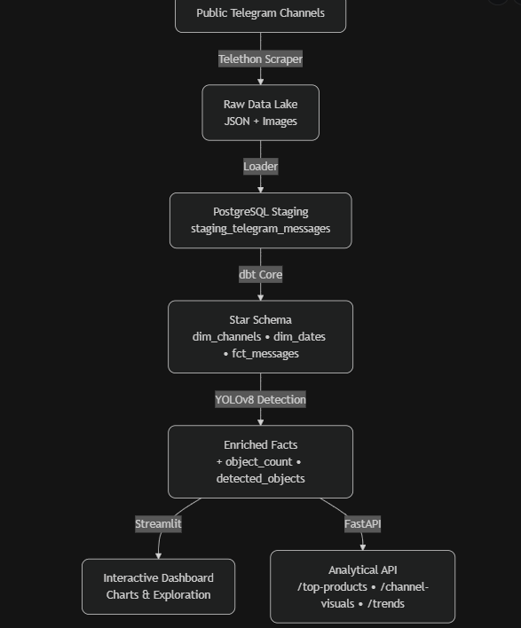

# Medical Telegram Market Intelligence Pipeline

[](https://www.python.org/downloads/)
[](https://opensource.org/licenses/MIT)
[](https://github.com/Beza-Oriyon/medical-telegram-warehouse/actions/workflows/ci.yml)

**End-to-end data pipeline** that transforms **public Ethiopian Telegram messages** into **actionable market intelligence** for pharmaceuticals, cosmetics, and medical products.

### Business Value (Finance & Market Intelligence Perspective)

In emerging markets like Ethiopia, informal Telegram channels are a key source of real-time signals for:
- Competitive product mentions (drugs, creams, vaccines, cosmetics)
- Pricing and demand trends
- Counterfeit / unregulated product risk
- Supply chain visibility

This project delivers a **reproducible, tested pipeline** that:
- Scrapes public channels
- Loads & structures data in Postgres
- Applies dbt for star schema
- Enriches images with YOLOv8 object detection
- Provides analytical API (FastAPI) and interactive dashboard (Streamlit)

### Key Results (from 399 real messages)

- Channels processed: lobelia4cosmetics, tikvahethiopia, medicalethiopia, etc.
- Messages loaded & transformed: **399**
- YOLO detections: person, bottle, bowl, clock, tie, chair, couch, etc.
- Top keywords: "Vacancy Announcement", "Bebe cream Price", "Advertisement", "cream", "pills"
- Interactive dashboard: live charts for top products, YOLO stats, posting trends
- Analytical API: endpoints for top-products, channel-visuals, trends

### Quick Start

```bash
# 1. Clone repository
git clone https://github.com/Beza-Oriyon/medical-telegram-warehouse.git
cd medical-telegram-warehouse

# 2. Create & activate virtual environment
python -m venv venv
.\venv\Scripts\activate          # Windows cmd
# or .\venv\Scripts\Activate.ps1 # PowerShell

# 3. Install dependencies
pip install -r requirements.txt

# 4. Create .env (copy template and edit)
copy .env.example .env
# → Edit .env with your POSTGRES_PASSWORD

# 5. (Optional) Load existing data or re-run pipeline
python dashboard/app.py load

# 6. Run dbt transformations
cd medical_warehouse_dbt
dbt run
cd ..

# 7. (Optional) Run YOLO image enrichment
python src/scripts/enrich_images_yolo.py

# 8. Launch dashboard
python -m streamlit run dashboard/app.py
# → Open http://localhost:8501



.
├── dashboard/                  # Streamlit dashboard (app.py)
├── data/                       # Raw scraped JSON + images (gitignored)
├── logs/                       # Application logs
├── medical_warehouse_dbt/      # dbt project (models, tests, sources)
├── src/
│   ├── api/                    # FastAPI analytical endpoints
│   ├── scripts/                # scraper, loader, yolo enrichment
│   └── utils/
├── tests/                      # pytest unit & integration tests
├── .github/workflows/          # GitHub Actions CI (lint + tests)
├── .env.example
├── requirements.txt
└── README.md